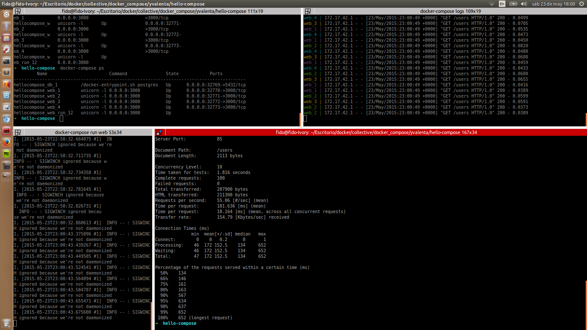
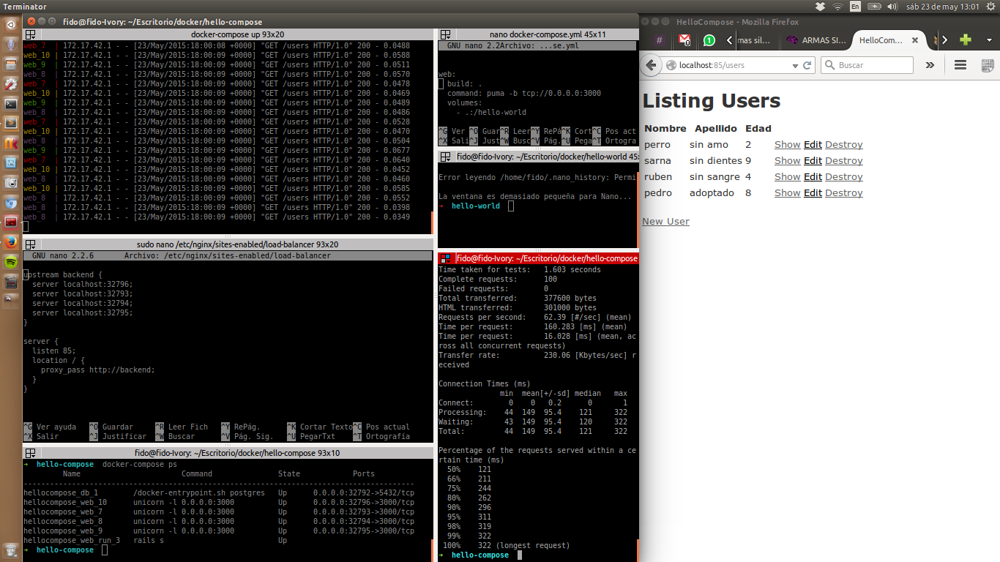

##Hello world with docker-compose

Rails sample application with docker-compose


##Run


###docker-compose ps

####Output
```ruby
       Name                      Command               State             Ports
---------------------------------------------------------------------------------------
hellocompose_db_1     /docker-entrypoint.sh postgres   Exit 0   0.0.0.0:32792->5432/tcp
hellocompose_web_10   unicorn -l 0.0.0.0:3000          Exit 0   0.0.0.0:32796->3000/tcp
hellocompose_web_7    unicorn -l 0.0.0.0:3000          Exit 0   0.0.0.0:32793->3000/tcp
hellocompose_web_8    unicorn -l 0.0.0.0:3000          Exit 0   0.0.0.0:32794->3000/tcp
hellocompose_web_9    unicorn -l 0.0.0.0:3000          Exit 0   0.0.0.0:32795->3000/tcp
```

## Starting
###docker-compose run web
```ruby
         Name                        Command               State            Ports
------------------------------------------------------------------------------------------
hellocompose_db_1         /docker-entrypoint.sh postgres   Up      0.0.0.0:32769->5432/tcp
hellocompose_web_run_12   unicorn -l 0.0.0.0:3000          Up
```

## Scaling to 4
### docker-compose scale web=4

```ruby
         Name                        Command               State            Ports
------------------------------------------------------------------------------------------
hellocompose_db_1         /docker-entrypoint.sh postgres   Up      0.0.0.0:32769->5432/tcp
hellocompose_web_1        unicorn -l 0.0.0.0:3000          Up      0.0.0.0:32770->3000/tcp
hellocompose_web_2        unicorn -l 0.0.0.0:3000          Up      0.0.0.0:32771->3000/tcp
hellocompose_web_3        unicorn -l 0.0.0.0:3000          Up      0.0.0.0:32772->3000/tcp
hellocompose_web_4        unicorn -l 0.0.0.0:3000          Up      0.0.0.0:32773->3000/tcp
hellocompose_web_run_12   unicorn -l 0.0.0.0:3000          Up
```

##Load balancer with nginx

###configuration /etc/nginx/sites-enabled/load-balancer
```
upstream backend {
  server localhost:32770;
  server localhost:32771;
  server localhost:32772;
  server localhost:32773;
}

server {
  listen 85;
  location / {
    proxy_pass http://backend;
  }
}
```

## Output log
###ab -n 100 -c 10 http://0.0.0.0:85/users


```ruby
Benchmarking 0.0.0.0 (be patient).....done


Server Software:        nginx/1.4.6
Server Hostname:        0.0.0.0
Server Port:            85

Document Path:          /users
Document Length:        2113 bytes

Concurrency Level:      10
Time taken for tests:   1.816 seconds
Complete requests:      100
Failed requests:        0
Total transferred:      287900 bytes
HTML transferred:       211300 bytes
Requests per second:    55.06 [#/sec] (mean)
Time per request:       181.636 [ms] (mean)
Time per request:       18.164 [ms] (mean, across all concurrent requests)
Transfer rate:          154.79 [Kbytes/sec] received

Connection Times (ms)
              min  mean[+/-sd] median   max
Connect:        0    0   0.2      0       1
Processing:    46  172 152.5    134     652
Waiting:       46  172 152.5    134     652
Total:         47  172 152.5    134     652

Percentage of the requests served within a certain time (ms)
  50%    134
  66%    146
  75%    161
  80%    163
  90%    567
  95%    634
  98%    637
  99%    652
 100%    652 (longest request)
```




